# React Native with Material You (In Development...)

This library follows UI components
from [Google Material 3 Design Kit](https://www.figma.com/community/file/1035203688168086460)

## Loot bag

* 5 button types
* 3 card types
* 4 chip types
* 1 dialog
* 4 FAB types

## How to install

???

## Show me the components

#### Buttons
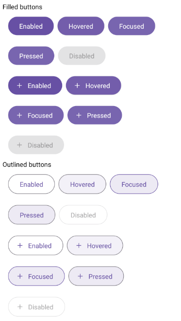
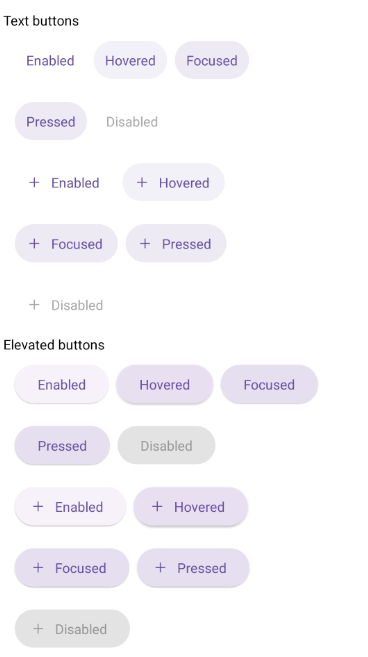
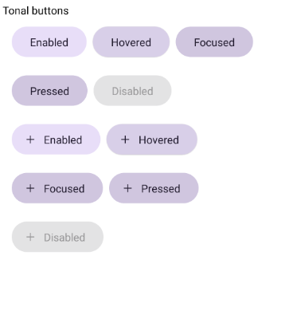

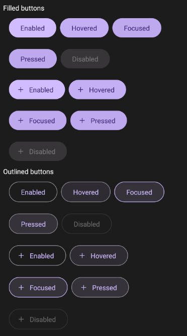
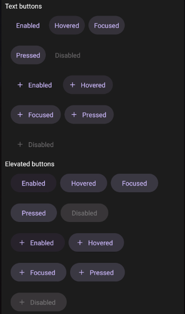
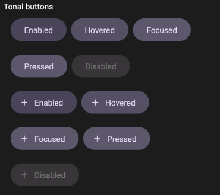

#### Cards

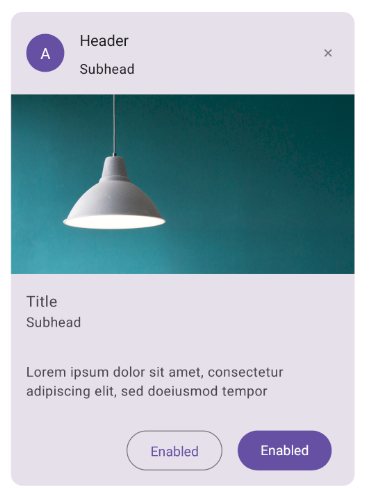
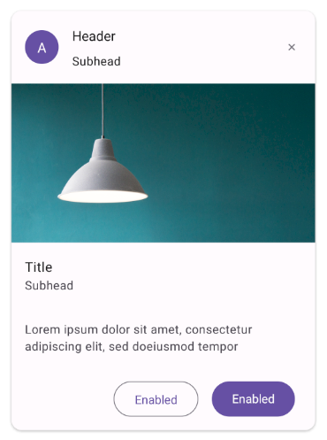
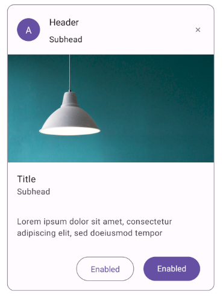
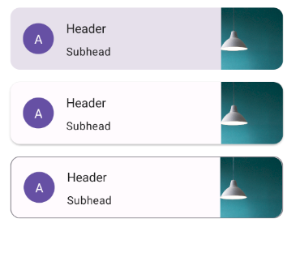

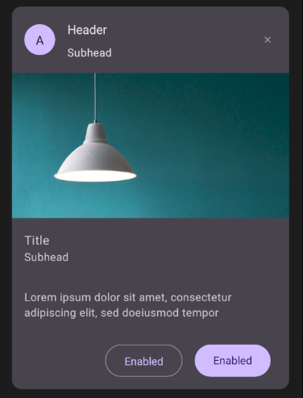
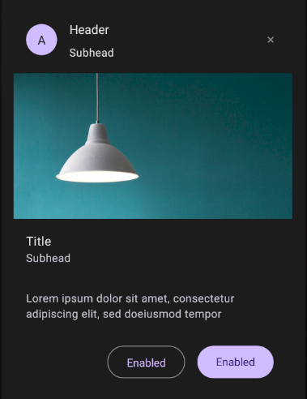
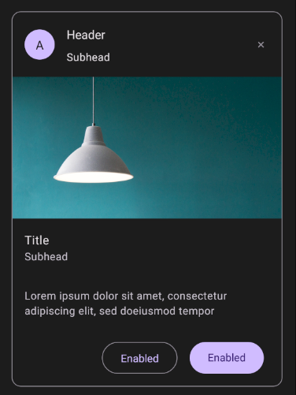
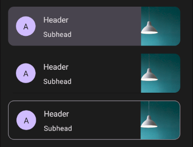

#### Chips

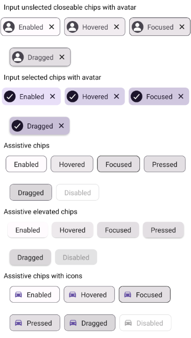
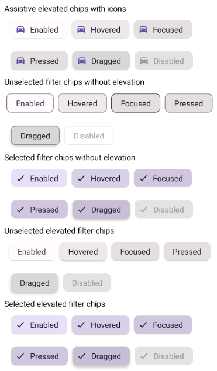
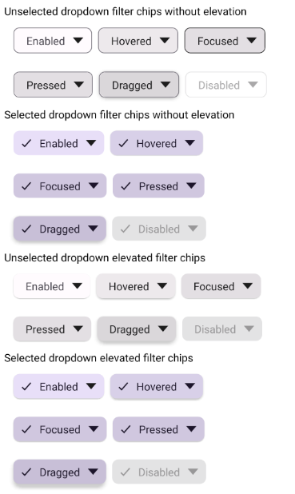
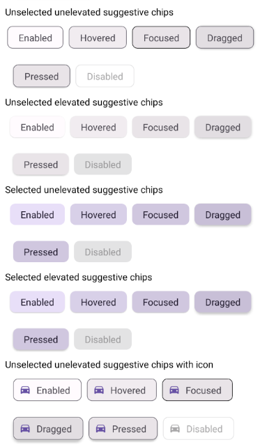
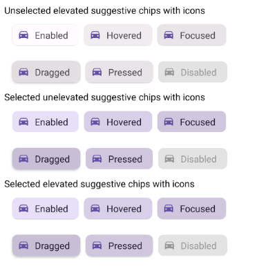

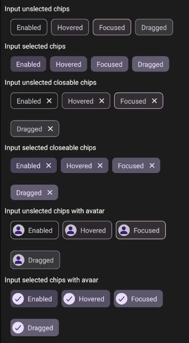
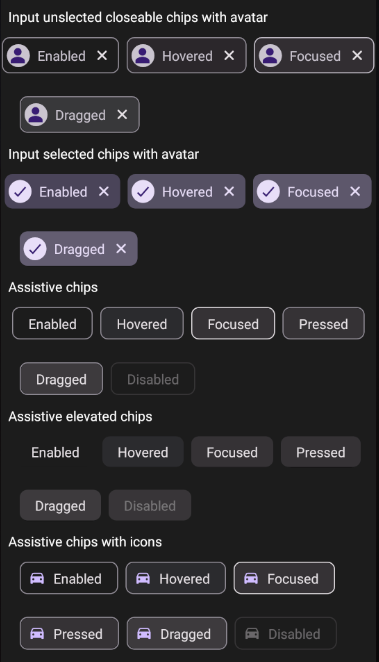
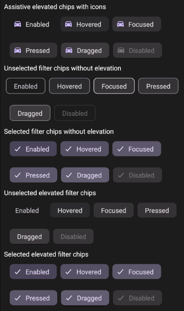
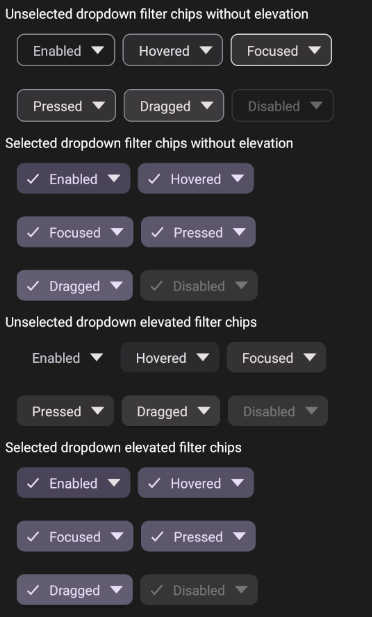
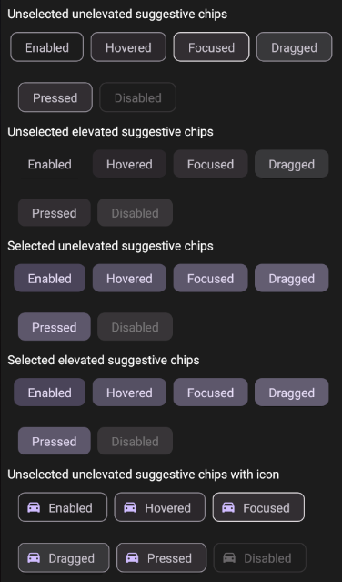
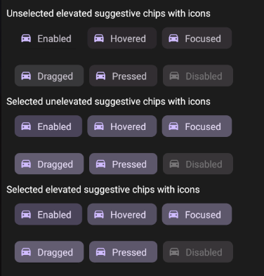

#### Dialog

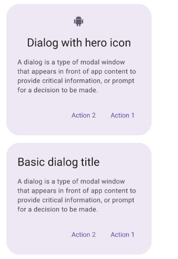
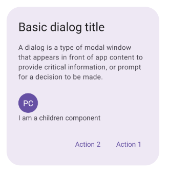

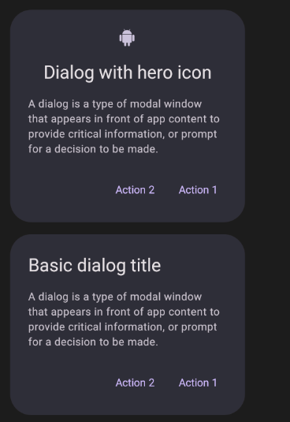
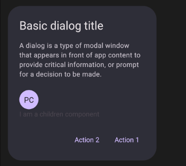

#### FAB

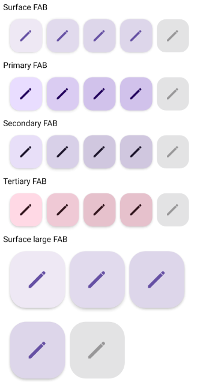
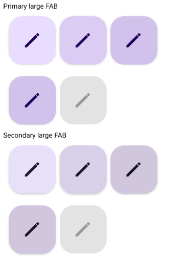
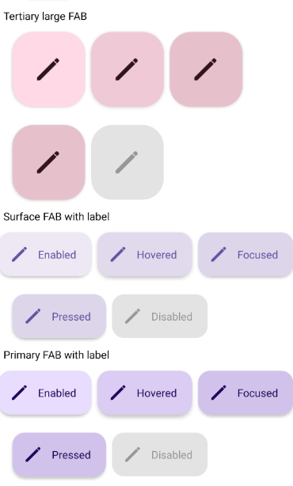
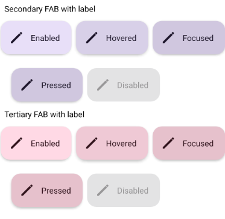

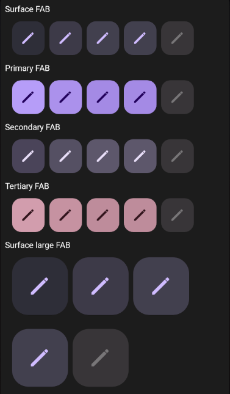
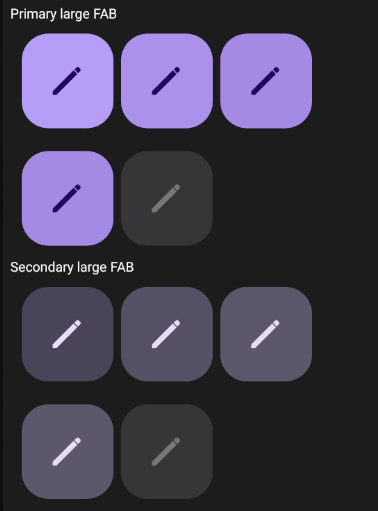
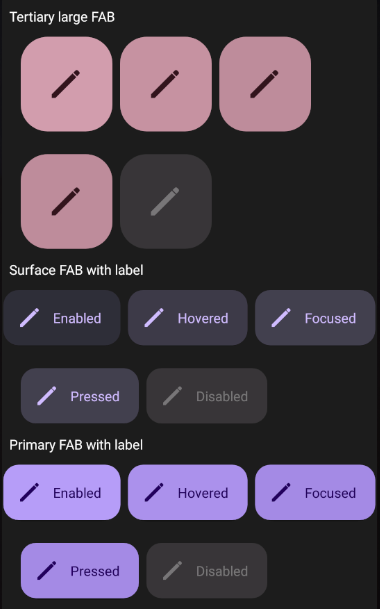
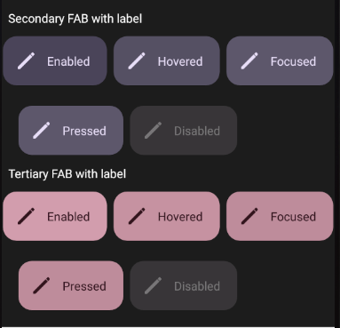

## Show me the code

???

## Contributing

???